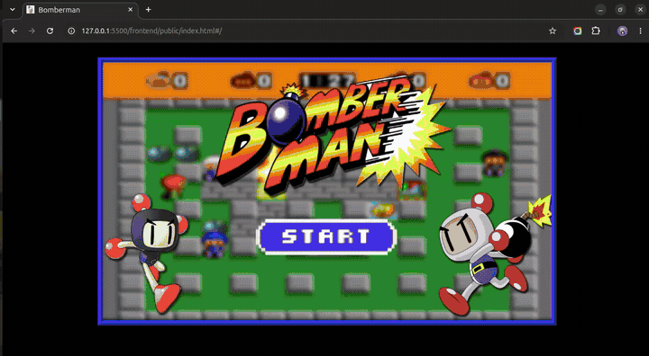

# BOMBERMAN - DOM


## Table of Contents

1. [Showcase](#showcase)
2. [Description](#description)
3. [Objectives](#objectives)
4. [Technologie used](#technologie-used)
5. [File system](#file-system) 
6. [Game structure](#game-structure)
7. [Implementation detail](#implementation-details)
8. [How to install ?](#how-to-install)
9. [How to run the program ?](#how-to-run-the-program)
10. [How to play ?](#how-to-play)
11. [Authors](#authors)

***
## Showcase



### Description

***Welcome bomber* !**  

Bomeberman-dom consists of making a multiplayer version of [bomberman game](https://en.wikipedia.org/wiki/Bomberman). It is a game in which  players must attempt to eliminate each other and be the last one standing
***
### Objectives

The main objectives of this project is to create a bomberman alike game, where multiple players can join in and battle until one of them is the last man standing. This must be done using the framework created in the [miniframework project](https://learn.zone01dakar.sn/git/root/public/src/branch/master/subjects/mini-framework)
***
### Technologie used

- 📝 **HTML**, The HyperText Markup Language is the standard markup language for documents designed to be displayed in at web browser.
<br>

- 🎨 **CSS**, Cascading Style Sheets, form a computer language that describes the presentation of HTML documents.  
<br>

- 🟡 **JAVASCRIPT**, also know as *JS*, is a scripting or programming language that allows you to implement complex features on web pages.
 it allows you to create dynamically updating content, control multimedia, animate images, and pretty much everything else. [click here for more details](https://developer.mozilla.org/en-US/docs/Learn/JavaScript/First_steps/What_is_JavaScript)
<br>

- 🟡  **01JS**, it is the framework created by *CMVS team* in the previous project. It simples the process of dom creation, routing system and state handling. [click here for more details](https://learn.zone01dakar.sn/git/mthiaw/mini-framework.git)
<br>

- 🔵🔴🟢 **FIGMA**, allows us to create, share, and test designs for websites, mobile apps, and other digital products and experiences. It is a popular tool for designers, product managers, writers and developers and helps anyone involved in the design process contribute, give feedback, and make better decisions, faster. [go visit website](https://www.figma.com/fr/)
***
## file-system

The file system  looks like this:

```
.
|
|____📁backend
|    |-----------📂socket-side
|    |           |----------- 🔵 connection.go
|    |           |----------- 🔵 counter.go
|    |           |----------- 🔵 createSocket.go
|    |           |----------- 🔵 handleOnlineUser.go
|    |           |----------- 🔵 obstacles.go
|    |           |----------- 🔵 players.go
|    |           |----------- 🔵 readconn.go
|    |           |----------- 🔵 struct.go
|    |           |----------- 🔵 websocketTools.go
|    |-----------⚙ go.mod
|    |-----------⚙ go.sum
|    |-----------🔵 main.go
|
|____📁frontend
|    |-----------📂 app
|    |           |-----------📁 game
|    |           |           |-----------(🟡 game elements js files)
|    |           |-----------📁 lib
|    |           |           |-----------(🟡 some ui generator files)
|    |           |-----------📁 routes
|    |           |           |-----------🟡 render.mjs
|    |           |-----------📁 utils
|    |           |           |-----------(🟡 UI event handlers)
|    |           |-----------📁 virtualObj
|    |           |           |-----------(🟡 UI object files)
|    |           |-----------🟡 main.js
|    |-----------📂 public
|    |           |-----------📁 assets
|    |           |           |-----------(🎇 images & font file)
|    |           |-----------📁 styles
|    |           |-----------|-----------🎨 animation.css
|    |           |-----------|-----------🎨 app.css
|    |           |-----------|-----------🎨 color.css
|    |           |-----------|-----------🎨 game.css
|    |           |-----------|-----------🎨 variables.css
|    |           |-----------|-----------🎨 style.css
|    |           |-----------📄 index.html
|    |-----------📂 src
|    |           |-----------( 🟡 01JS framework)
|____📜 README.md
```
***
### Game-structure

- N° of players: 2-4
- N° of lives per player: 3
- Blocks: cannot be destroyed
- Bricks: can be destroyed
- bomb: explodes after 5s after being dropped then destroys ennemies or bricks in explosion range
- 3 power ups : bomb (* Increases the amount of bombs dropped at a time by 1*), flames: (*Increases explosion range from the bomb in four directions by 1 block*), speed: (*Increases movement speed*)
***
## Implementation-details

The program is divided into several folders and files:

- `backend`: This folder stores all the server's logic used as an API. it handles real time communication, movements and map generating between players via sockets.
- `frontend`: This folder stores the frontend process. it contains:
    - `app`: This folder holds all oof the game's logic (registering, player selection, communication and gameplay).
    - `public`: all stylesheets and assets are stored here with the index.html file.
    - `src`: This folder stores the 01JS framework.  

Our pinball implementation goes through 4 steps:

- `Step one` - Store the player's choice and username in local storage

- `Step two` - Retrieve the informations from local storage then displays the map with the players

- `Step three` - listen to possible events (Arrow keys)

- `Step four` - handle explosion and live movements.  
***
## how to install?
```bash
 $ git clone https://learn.zone01dakar.sn/git/vindour/bomberman-dom.git
```
***
## How-to-run-the-program?

To run the program, you need to have nodeJS and golang installed on your computer (*with the latest version if possible*).  
After installation, in your vscode, go in the extension menu and download a live server plugin.

then run the server
```bash
bomberman-dom$ cd backend
bomberman-dom/backend$ go run .
📡----------------------------------------------------📡
|                                                      |
| 🌐 Server has started at http://localhost:8080 🟢   | 
|                                                      |
📡----------------------------------------------------📡
```

finally, launch the preview of the index.html file
***

## how to play?

Use the Keypad to handle the player:

- press arrow keys to move the player
- press spacebar to drop a bomb
- if player get caught in explosion he loses one life
- player dies after losing his 3 lives
- last player standing wins  

are you a bomber😏? proove your skills ✨!

### Authors

- ***C***heickh NDIAYE ( [*cheikhndiaye9*](https://learn.zone01dakar.sn/git/cheikhndiaye9) )

- ***M***asseck THIAW ( [*mthiaw*](https://learn.zone01dakar.sn/git/mthiaw) )

- ***V***incent Félix NDOUR ( [*vindour*](https://learn.zone01dakar.sn/git/vindour) ) - **captain 👑**

- ***S***erigne Khadim DIENE ( [*sdiene*](https://learn.zone01dakar.sn/git/sdiene) )


###### *@Licensed by team CMVS*
